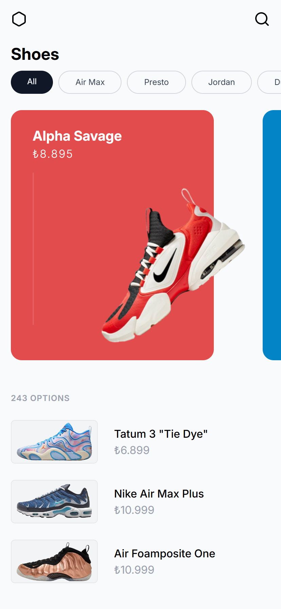

# Shoes

[](https://github.com/emirhansirkeci/shoe/blob/main/README.md)

Sadece pratik yapmak için oluşturulmuş basit bir React uygulaması. Uygulama **yalnızca mobil ve tablet uyumlu** olacak şekilde optimize edilmiştir, çünkü tasarım bu ekran boyutlarını kapsıyor. Sadece yapı ve layout odaklı çalıştığım için etkileşimler basit tutulmuştur.

## Tech Stack

- [Vite](https://vitejs.dev/)
- [React](https://react.dev/)
- [TailwindCSS](https://tailwindcss.com/)
- [React Router](https://reactrouter.com/)
- [Motion](https://motion.dev/)

## Geliştirici Notları

### vite.config.ts

```ts
server: {
  host: true, // 192.168.x.x üzerinden erişim için true olarak ayarlandı, gerektiğinde kendi ortamınıza göre değiştirin
  port: 5173,
}
```

## Ekran Görüntüleri

<div style="display: flex; gap: 32px; flex-wrap: wrap;">
  
  
</div>
