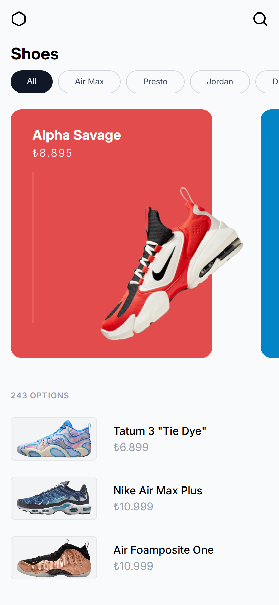
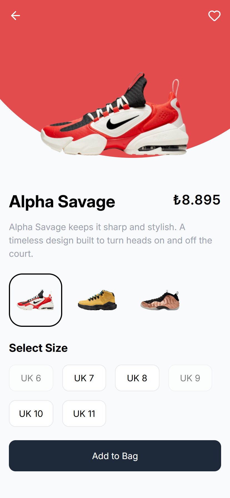

# Shoes

[](https://github.com/emirhansirkeci/shoe/blob/main/README-tr.md)

Just a basic React application built for practice. It is **only optimized for mobile and tablet**, since the design covers those breakpoints. The interactions are simple and not heavily optimized; the focus was mostly on structure and layout.

## Tech Stack

- [Vite](https://vitejs.dev/)
- [React](https://react.dev/)
- [TailwindCSS](https://tailwindcss.com/)
- [React Router](https://reactrouter.com/)

## Development Notes

### vite.config.ts

```ts
server: {
  host: true, // set to true so you can access via 192.168.x.x, adjust as needed
  port: 5173,
}
```

## Screenshots

<div style="display: flex; gap: 32px; flex-wrap: wrap;">
  
  
</div>
